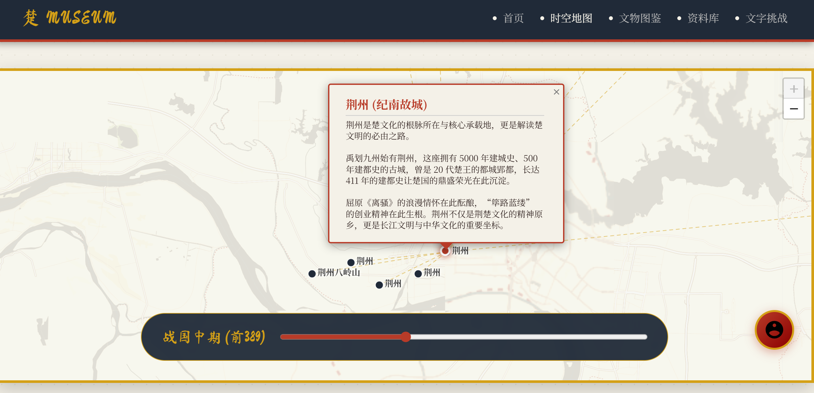
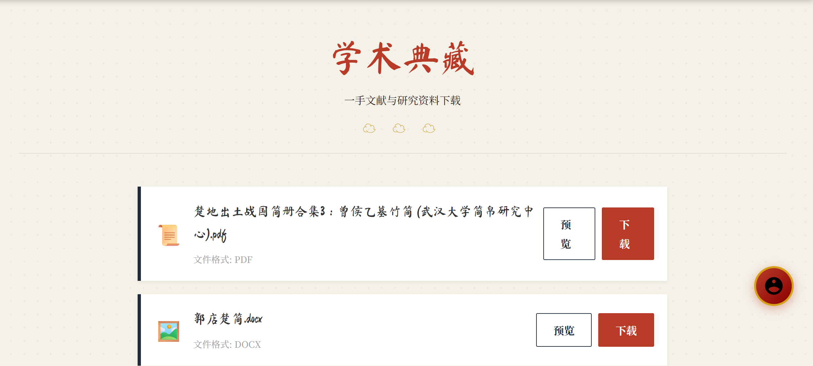
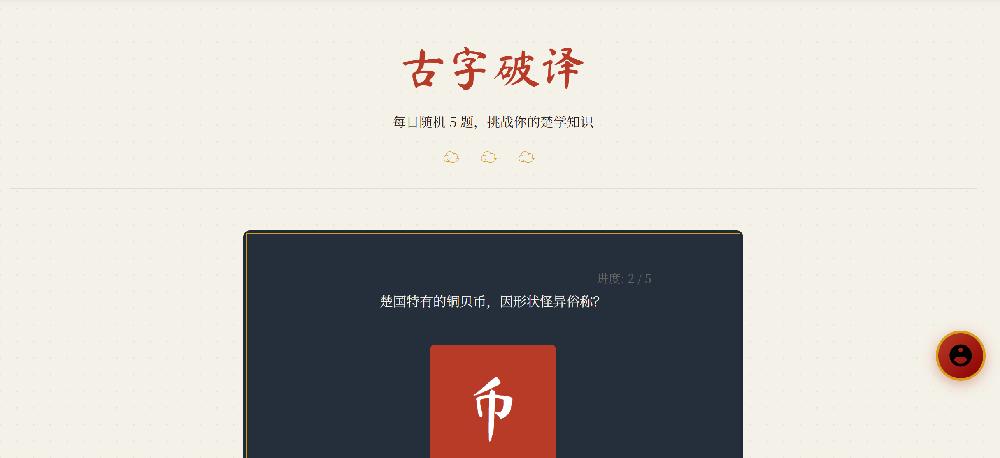
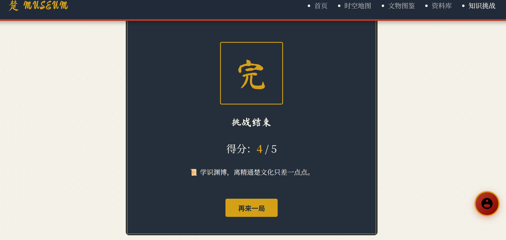
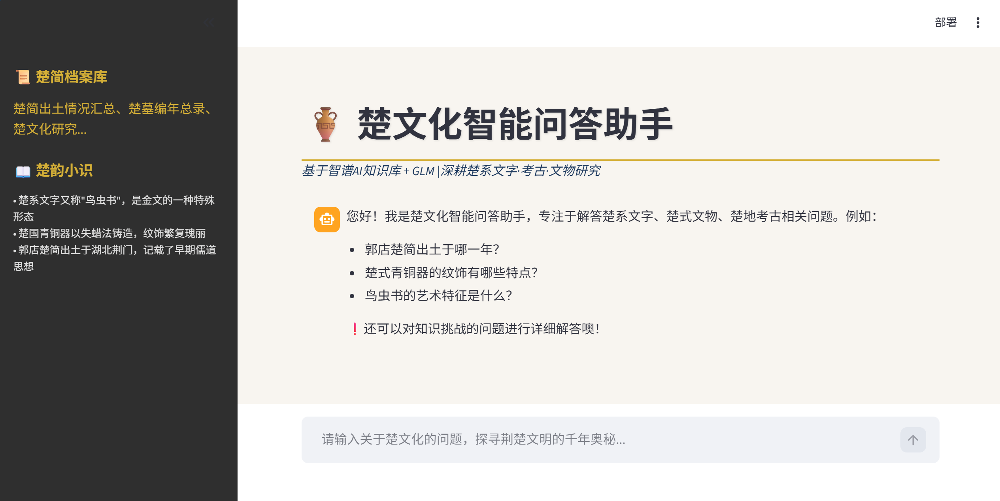
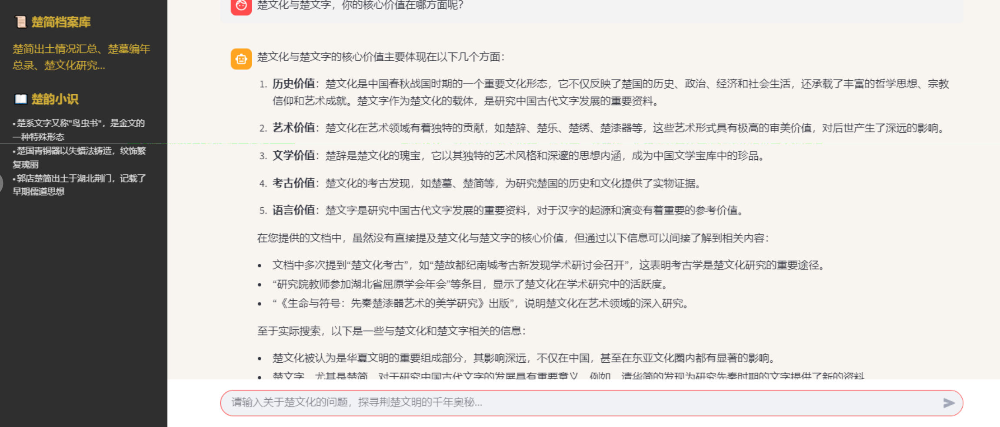
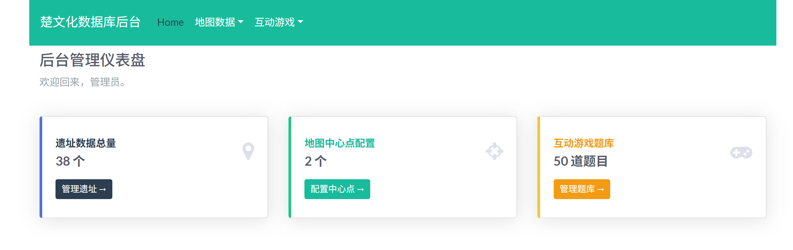
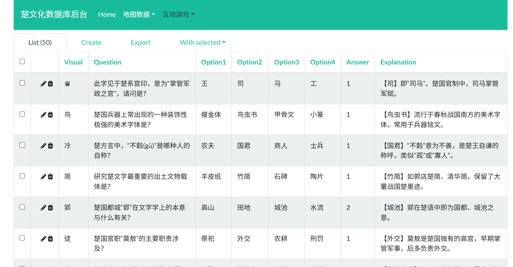

READ
# 楚文字知识性科普网站 (Chu Script Knowledge Popularization Platform)

[](https://www.python.org/)
[](https://flask.palletsprojects.com/)
[](LICENSE)

> 一个集学术性与趣味性于一体的 Web 平台，致力于通过数字化手段普及**楚系文字**与**楚地考古文化**。系统整合了时空地图、文物图鉴与交互式文字破译游戏，生动呈现从西周至战国时期的楚文明风貌。

 [功能特性](#-功能特性) | [快速开始](#-快速开始-本地开发) | [部署指南](#-生产环境部署)

---

## 📖 项目简介

本项目旨在降低公众接触古文字的门槛。通过 Leaflet 交互地图展示楚文化疆域变迁，结合“古字破译”互动游戏，让用户在娱乐中学习楚系简帛文字、鸟虫书及官印文字知识。后台配备完善的数据管理系统，支持内容的可视化维护。

### ✨ 功能特性

*   **🗺️ 时空可视化地图**：
    *   动态时间轴：展示楚国疆域随年代的变化。
    *   遗址分布：点击地图坐标查看相关出土简牍与文物详情。
    *   中心点标记：突出显示楚国都城等重要地理位置。
    *   时代筛选：通过时间轴滑块筛选不同时期的遗址分布。

*   **🖼️ 简牍图鉴**：
    *   文物展示：以卡片形式展示楚地出土的简牍文物。
    *   高清影像：提供文物的高清图片和详细说明。
    *   分类标签：按文物类型进行分类展示。
    *   悬停效果：鼠标悬停显示文物详细信息。

*   **📚 学术资料库**：
    *   资料下载：提供楚文化研究相关的 PDF 文档和图片资料。
    *   在线预览：支持在线预览 PDF 和图片文件。
    *   文件管理：后台支持资料的上传、删除管理。
    *   分类浏览：按文件类型自动分类显示。

*   **🎮 楚韵·文字挑战**：
    *   每日随机题库：基于 JSON/数据库 的 50+ 道题库，涵盖字形辨析、历史典故与器物知识。
    *   互动反馈：即时判断正误，提供详细的学术解析。


*   **🤖 楚文化智能助手**：
    *   AI 对话问答：基于智谱 AI 知识库，解答楚系文字、楚式文物、楚地考古相关问题。
    *   悬浮球入口：页面右下角设有可拖动的 AI 助手悬浮球，长按可拖动位置，单击直接跳转。
    *   知识检索：支持从知识库中检索相关内容，并提供引文标注，确保回答有据可查。



* **🛡️ 综合管理后台**：
    *   可视化仪表盘：实时统计题库数量、遗址点位与访问数据。
    *   数据管理：支持对题库、遗址坐标、中心点配置的增删改查 (CRUD)。
    *   安全认证：基于 Flask-Login 的管理员权限控制。


---

## 🛠️ 技术栈

*   **后端核心**：Python Flask, SQLAlchemy (ORM)
*   **后台管理**：Flask-Admin, Flask-Login
*   **前端交互**：HTML5, CSS3 (自定义样式), JavaScript (ES6+), Leaflet.js (地图)
*   **AI 智能助手**：Streamlit, ZhipuAI (智谱 AI) SDK, Zai 知识库
*   **数据存储**：SQLite (本地开发) / PostgreSQL (生产环境)
*   **服务器**：Nginx + Gunicorn

---
## 🐳 Docker 快速部署 (推荐)

本项目已支持 Docker 容器化部署，内置 Python Web 环境与 PostgreSQL 数据库，无需手动安装依赖和配置数据库。

### 1. 准备工作
确保本地或服务器已安装 [Docker](https://www.docker.com/) 和 [Docker Compose](https://docs.docker.com/compose/)。

### 2. 获取代码
```bash
git clone https://github.com/lvyums/chu2.git
cd chu2
```
### 3. 启动服务
运行以下命令构建镜像并启动容器：
```bash
docker-compose up -d --build
```
第一次运行需要下载基础镜像，请耐心等待。

### 4.初始化数据 (首次运行必须执行)
容器启动后，数据库是空的，需要执行以下命令初始化表结构并导入预设数据：
```bash
# 1. 初始化数据库表结构
docker-compose exec web python migrate.py init

# 2. 导入 JSON 数据 (题库和遗址信息)
docker-compose exec web python migrate.py migrate
```
### 5. 访问项目
前台页面: http://localhost:5000
后台管理: http://localhost:5000/admin (需先在 app.py 配置 Flask-Admin)
💾 数据库管理
项目使用 PostgreSQL 存储数据，Docker 已配置好端口映射，你可以使用 Navicat / DBeaver 直连管理。

| 配置项	                       | 默认值 (docker-compose.yml) |
|----------------------------|--------------------------|
| 主机	| localhost (服务器请填写服务器IP)  |
| 端口	| 5432                     |
| 数据库| 	chu_db                  |
| 用户名| 	postgres              |
| 密码	| postgres           |

⚠️ 生产环境安全警告:
如果部署在公网服务器，请务必修改 docker-compose.yml 中的 POSTGRES_PASSWORD，并建议移除 ports: - "5432:5432" 映射，防止数据库端口暴露在公网被暴力破解。

## 🚀 本地开发

### 1. 克隆项目
```bash
git clone https://github.com/yourusername/chu-script-web.git
cd chu-script-web
```
### 2. 环境配置
建议使用 Python 虚拟环境以隔离依赖：

Windows:

```Bash
python -m venv venv
venv\Scripts\activate
```
Linux / macOS:

```Bash
python3 -m venv venv
source venv/bin/activate
```
安装依赖:

```Bash
pip install -r requirements.txt
```
### 3.配置环境变量

在项目根目录创建 .env 文件:

 Flask 配置
````
FLASK_APP=app.py
FLASK_ENV=development
SECRET_KEY=dev-key-please-change-in-prod
````
数据库配置 (默认使用本地 SQLite)
````
DATABASE_URL=sqlite:///chu.db
````
后台管理员默认密码
````
ADMIN_PASSWORD=123456
````

AI 助手配置 (可选)
````
ZHIPUAI_API_KEY=your_zhipu_api_key
KNOWLEDGE_BASE_ID=your_knowledge_base_id
````
### 4.数据初始化

本项目包含自动迁移脚本，可将静态 JSON 数据导入数据库：

1. 初始化数据库表结构
````
python migrate.py init
````
2. 导入题库和遗址数据 (读取 static/quiz_questions.json 等)
````
python migrate.py migrate
````
 3. (可选) 验证数据完整性
````
python migrate.py validate
````
 4. 启动应用

```Bash
python app.py
前台首页: http://127.0.0.1:5000
管理后台: http://127.0.0.1:5000/admin
```

### 5. 启动 AI 智能助手 (可选)

AI 助手基于 Streamlit 构建，需要单独启动：

```Bash
# 安装依赖
pip install streamlit zai

# 启动 AI 助手服务
streamlit run ai_assistant.py
# AI 助手访问地址: http://127.0.0.1:8501

# 悬浮球链接配置
# 修改 static/js/aiAssistantModule.js 中的 AI_ASSISTANT_URL 变量
```
# 🔧 数据维护指南
方式一：通过管理后台 (推荐)
登录 /admin 后台，进入**“互动游戏-题库管理”或“地图数据-遗址列表”**，即可进行可视化的添加和修改。修改即时生效。

方式二：通过 JSON 文件 (批量更新)
修改 static/quiz_questions.json 或 sites.json 文件。
运行迁移命令更新数据库：

```Bash
python migrate.py migrate
```
# 📦 生产环境部署
1. 准备 PostgreSQL 数据库

```Bash
# 登录 Postgres
sudo -u postgres psql

# 创建库和用户
CREATE DATABASE chu_web_db;
CREATE USER chu_admin WITH PASSWORD 'strong_password';
GRANT ALL PRIVILEGES ON DATABASE chu_web_db TO chu_admin;
```
2. 更新生产环境配置 (.env)

```Ini
FLASK_ENV=production
DATABASE_URL=postgresql://chu_admin: strong_password@localhost/chu_web_db
SECRET_KEY=generate-a-random-strong-key-here
ADMIN_PASSWORD=complex_admin_password
```
3. 配置 Gunicorn 与 Systemd
创建服务文件 /etc/systemd/system/chuweb.service：

```Ini
[Unit]
Description=Chu Script Website Gunicorn Daemon
After=network.target

[Service]
User=www-data
Group=www-data
WorkingDirectory=/var/www/chu-script-web
Environment="PATH=/var/www/chu-script-web/venv/bin"
ExecStart=/var/www/chu-script-web/venv/bin/gunicorn --workers 3 --bind unix:chuweb.sock app:app

[Install]
WantedBy=multi-user.target
```
4. 配置 Nginx 反向代理

```Nginx
server {
    listen 80;
    server_name yourdomain.com;

    location / {
        include proxy_params;
        proxy_pass http://unix:/var/www/chu-script-web/chuweb.sock;
    }

    location /static {
        alias /var/www/chu-script-web/static;
    }
}
```
# 🤝 贡献与反馈
欢迎对楚文化感兴趣的开发者参与贡献！

Fork 本仓库。
创建特性分支 (git checkout -b feature/NewQuizType)。
提交代码并推送。
发起 Pull Request。

# 📄 版权说明
本项目内容（文本、代码）遵循 MIT 协议。
部分文物图片来源于公开网络资料，版权归原博物馆所有，仅作科普展示用途。